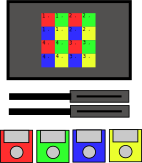
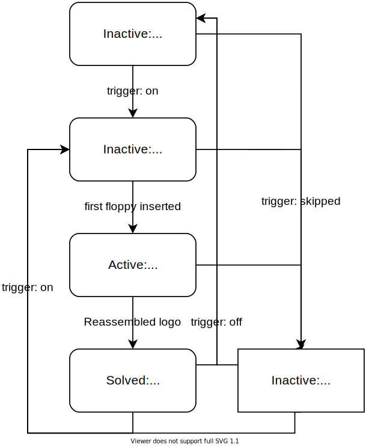

# Prototype
The goal of the escape room is to steal and upload secret prototype data. This group was responsible for designing the storage device, the first step for uploading the data and surrounding puzzles. We chose floppy disks as storage devices. The floppys were hidden inside a safe, which was build by the safe group. The floppys are lying on a scale, which was build by us, so that it can be detected if they were taken. Using these floppys the players are able to "upload" the data by solving a picture rearranging puzzle in the server room.

## Scale Puzzle
### Building the scale
Plexiglas plates, a 5 kg load cell with an HX711 and an ESP8266 were used for building the scale. The ESP is responsible for checking the weight and handling the MQTT connection. The state machine that runs the puzzle and is handling the communication can be seen in the [presentation](Ubilab_Scale_Presentation.pdf).

### Building the software for the scale
The software for the ESP8266 is build using the Arduino IDE (1.8.10). The following configurations were made in the IDE:
Add the following board manager URL in Preferences -> Additional Boards Manager URLs: https://arduino.esp8266.com/stable/package_esp8266com_index.json
Install the following board under Tools -> Board: -> Boards Manager... :
- esp8266 by ESP8266 Community (2.6.3)
In Tools -> Board select the "Generic ESP8266 Module".
No further selections are made in the Tools tab.

Additionally the following libraries are used:
- Arduinojson by Benoit Blanchon (6.14.0)
- HX711 Arduino Library by Bogdan Necula, Andreas Motl (0.7.2)
- PubSbubClient by Nick O'Leary (2.7.0)

Now open the project in the Arduino IDE and create a new file in the sketch called "wifi_pw.h". Add the following line with your WIFI password: const char* PASSWORD = "DEFAULT";

### MQTT commands to control the scale
The MQTT topic of the scale is: "6/puzzle/scale". The scale is also listening to the topic of the terminal puzzle ("6/puzzle/terminal"), because it switches to the solved state, if the terminal puzzle is reached and started with a floppy disk that was removed from the scale.
The following messages can be used to control the scale:
| method  | state  | data    |   | description                                                                                         |
|---------|--------|---------|---|-----------------------------------------------------------------------------------------------------|
| trigger | on     |         |   | Starts the puzzle (scale reacts to differences in weight).                                          |
| trigger | off    |         |   | Restarts the scale. Scale is recalibrated and waits for a new 'trigger on'.                         |
| trigger | off    | skipped |   | Puzzle switches immediately into the solved state. The scale waits for a 'trigger off' to restart. |
|         |        |         |   |                                                                                                     |
| status  | active |         |   |  The scale puzzle is solved. Scale is in solved state and waits for a 'trigger off'. (This message is sent by the terminal topic)|

The following messages are sent by the scale to report the current status:
| method | state    | data |   | description                                                                         |
|--------|----------|------|---|-------------------------------------------------------------------------------------|
| status | inactive |      |   | The scale has finished it's initialization and waits for a 'trigger on'.            |
| status | active   |      |   | The scale has received a 'trigger on' message and starts the puzzle.                |
| status | solved   |      |   | The scale puzzle is solved. Scale is in solved state and waits for a 'trigger off'. |

### Debug Mode
The scale has also a debug mode. To activate it the '#define DEBUG' has to be set in the code (see comment in code). The serial interface then outputs information about errors and the current state in the state machine. LEDs can also be connected to the ESP, the pins 0 for green and 5 for red are provided for this.

### Solving the puzzle by tricking STASIS
To get the 4 floppy disks (e.g. the prototype) out of the safe, you have to replace them with 4 different floppy disks, that can be found in the room. If you remove the prototype disks without replacing them, STASIS is very angry and wants the prototype back.

### Hints
1. Have you watched Indiana Jones? Maybe a famous scene inspires you.
2. Can you see more floppy disks outside the safe?
3. Try to replace the floppy disks inside the safe.

## Reading the prototype

### Building the puzzle
A raspberry pi, a 7 inch touchscreen display and two USB floppy drives were used for this puzzle. The parts were mounted to a lasercutted and engraved wooden panel. This panel is set into a "server rack" inside the server room.

On this screen the Logo chosen for Stasis is visible on a 4 by 4 grid of colored tiles as can be seen in the figure above. When inserting the first floppy the picture gets scrambled and needs to be reassambled. This can be done by inserting the floppys into the drives which trigger different movements in the picture based on the floppy drive as well as the floppy inserted. One drive causes the tiles of the same color of the floppy to rotate by 90°, the other causes the tiles of the color of the inserted floppy to jump to the next position (1 -> 2, 2 -> 3 ... 4 -> 1). After rearrangement the logo turns grey and the puzzle is solved. The visualization on the screen is done with [ncurses](https://invisible-island.net/ncurses/announce.html) in the terminal. To have a good resolution the font size has to be minimal.

We changed the disk identifiers of the four prototype floppy disks to 1, 2, 3, 4. Which floppy drive is inserted into which drive can be detected by running this [script](check_floppy.sh) peridodically. This output is then used for rotating the image accordingly. For the MQTT communication the [paho library](https://github.com/eclipse/paho.mqtt.c) was used. The definition of the protocol can be seen [here](https://github.com/ubilab-escape/operator#%CE%BCc-communication).

#### Hack for malfunctioning floppy
One of the floppy drives got stuck if the floppy was ejected at the wrong time. This led to a timeout of the script. If a timeout occured the usb ports were turned off and on to restart the floppy drive. [Uhubctl](https://github.com/mvp/uhubctl) was used for this. This could be removed if the puzzle was rebuilded with a new floppy drive.

### Solving the puzzle by reassembling the image
To read the data from the prototype you have to reassemble an image. The image shifts depending on which disk is inserted into which reader. The colors of the disks match the part of the image that is changed. One reader shifts the position of the matching colored part, the other rotates the matching colored parts themselves.

### Hints
1. Be patient, watch closely and reassemble the image
2. You need all four floppy disks
3. The floppy disk colors match the image colors
